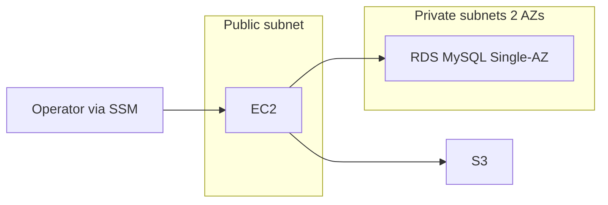

# Level 1 — Startup

Minimal single-AZ app footprint: one EC2 (SSM, no SSH), single-AZ RDS MySQL, and a private S3 bucket.

## Architecture

## Key decisions and trade-offs

- No NAT Gateway: EC2 sits in a public subnet for outbound/SSM endpoints cost savings; no inbound SSH or key pair.
- RDS still uses two private subnets in two AZs because AWS requires a DB subnet group spanning ≥2 AZs even for Single-AZ instances.
- Credentials via `manage_master_user_password` (Secrets Manager); never in tfvars.
- KMS encryption for RDS and S3; S3 public access block on.
- Least-privilege IAM: only `AmazonSSMManagedInstanceCore` on the instance profile.

## Approximate cost estimate

**Approximate estimate** (idle `eu-west-1`, t3.micro + db.t3.micro): ~15–30 USD/month (EC2 + EBS + RDS storage + S3 + KMS). No NAT.

## Interview questions

1. **Why no NAT but still two private subnets?** — NAT is for private-subnet egress; L1 keeps compute public for cost. RDS DB subnet groups require subnets in ≥2 AZs regardless of Multi-AZ.
2. **Why SSM instead of SSH?** — No open port 22 or key distribution; access via IAM + Session Manager.
3. **Where is the DB password?** — RDS manages it in Secrets Manager (`manage_master_user_password`); not in Terraform variables.

Validated with `terraform validate`, not deployed.
