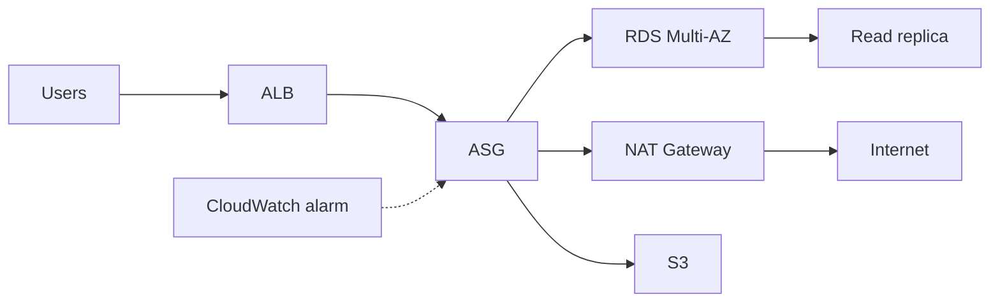

# Level 2 — Growth

HA web tier: ALB + ASG (CPU target tracking) in private subnets, one NAT, Multi-AZ RDS + read replica, S3, and a CloudWatch CPU alarm.

## Architecture

## Key decisions and trade-offs

- One NAT Gateway (cost vs HA): Multi-AZ NAT is a next step if AZ failure of the NAT AZ is unacceptable.
- ASG in private subnets; ALB in public; egress via NAT.
- Read replica requires `backup_retention_period >= 1` (enforced by variable validation).
- CloudFront, WAF, and multi-NAT are **next steps** only (not in this stack).
- SSM on instances; no SSH.

## Approximate cost estimate

**Approximate estimate** (idle `eu-west-1`): ~90–160 USD/month (ALB + NAT + Multi-AZ RDS + replica + 2× t3.micro + S3/KMS). Dominated by NAT and Multi-AZ RDS.

## Interview questions

1. **Why private ASG + public ALB?** — ALB terminates public HTTP; instances stay private with outbound via NAT and inbound only from the ALB SG.
2. **Why backup retention ≥ 1 for a replica?** — AWS requires automated backups enabled on the source to create a read replica.
3. **What would you add next for edge protection?** — CloudFront + OAC for static assets; Regional WAF on the ALB; CloudFront WAF needs `us-east-1`.

Validated with `terraform validate`, not deployed.
