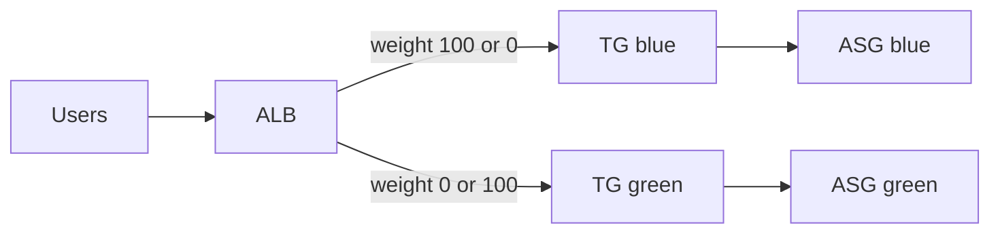

# Blue-green deployment

Two ASGs (blue and green), each attached to its own target group. The ALB listener uses weighted forward; `active_color` maps to 100/0 or 0/100 for instant cutover and rollback.

## Architecture

## Key decisions and trade-offs

- `module.asg` with `for_each` over `["blue","green"]` — no duplicated ASG blocks.
- Cutover is a variable flip (`active_color`), not a new stack.
- Both fleets run at desired=1 while idle → ~2× compute cost vs single fleet.
- No CodeDeploy; intentional simplicity for interview demos.
- Private ASGs + NAT; SSM, no SSH.

## Approximate cost estimate

**Approximate estimate** (idle `eu-west-1`): ~60–90 USD/month (ALB + NAT + 2× t3.micro). Dominated by NAT and dual fleet.

## Interview questions

1. **How do you roll back?** — Set `active_color` back to the previous color and apply; weights flip to 100/0 instantly.
2. **Blue-green vs canary?** — Blue-green is all-or-nothing cutover; canary shifts a small % first (lower blast radius, longer rollout).
3. **Why keep both ASGs warm?** — Instant switch needs healthy targets in the idle color; trade cost for rollback speed.

Validated with `terraform validate`, not deployed.
